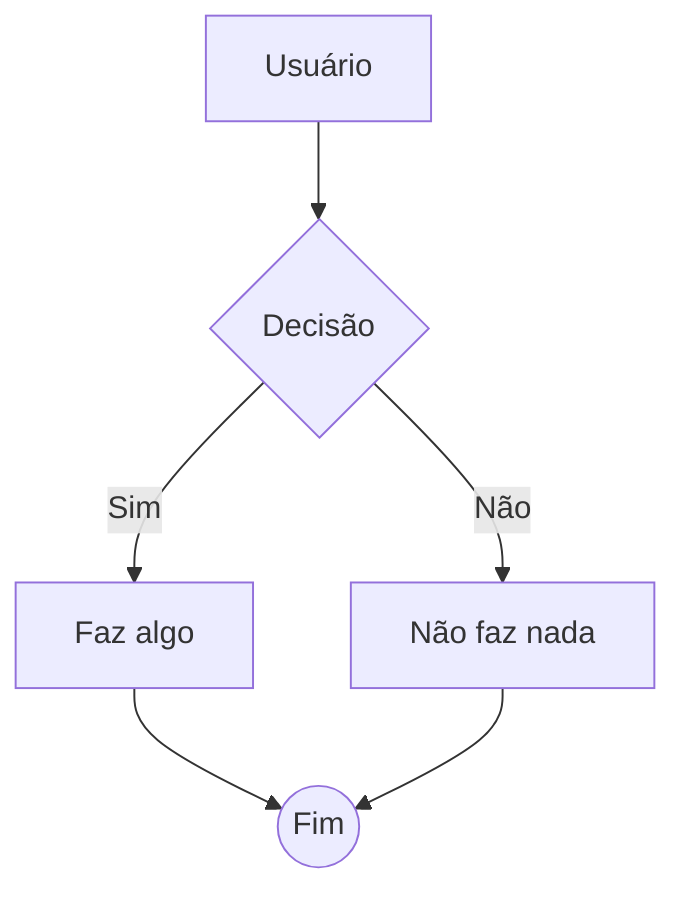
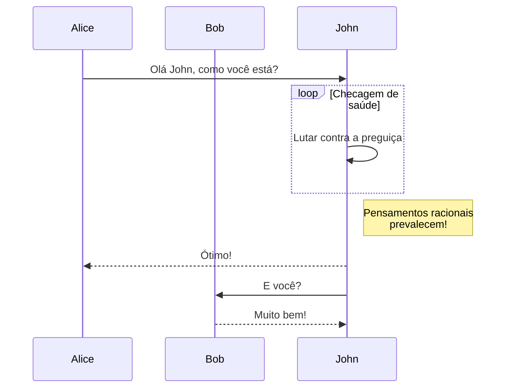
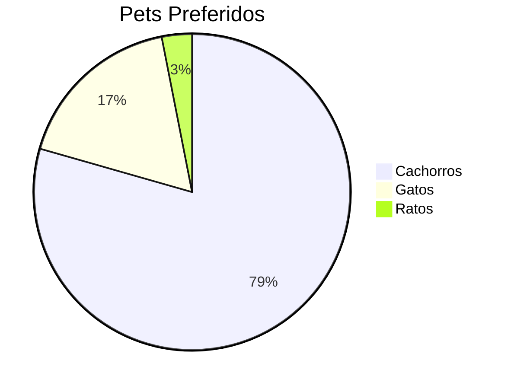

# 🚀 VellumMD: Test-Drive de Funcionalidades

Este documento foi gerado para você testar **absolutamente todos** os recursos de renderização que o VellumMD suporta. O editor possui um pipeline robusto baseado em _Unified, Remark e Rehype_.

Role este texto no painel de **Preview** para ver como tudo é renderizado!

---

## 1. Tipografia Básica (GFM)

O texto comum suporta **negrito**, *itálico*, ***negrito e itálico*** e ~~texto tachado~~. 
Você também pode usar `código inline` para destacar palavras.

### 1.1 Listas

**Lista não ordenada:**
* Item 1
* Item 2
  * Sub-item A
  * Sub-item B

**Lista ordenada:**
1. Primeiro passo
2. Segundo passo
   1. Sub-passo
   2. Outro sub-passo

**Lista de tarefas (Task List):**
- [x] Tarefa concluída
- [ ] Tarefa pendente
- [ ] Outra tarefa pendente

---

## 2. Callouts (Avisos Visuais)

Os callouts estilo GitHub são nativamente suportados para destacar informações cruciais.

> [!NOTE] Nota
> Esta é uma nota padrão. Ideal para informações adicionais que o leitor deve ter em mente.

> [!TIP] Dica
> Esta é uma dica. Ótimo para truques, atalhos ou melhores práticas.

> [!IMPORTANT] Importante
> Informação crucial que muda o contexto de leitura. Preste atenção!

> [!WARNING] Aviso
> Cuidado com isso. Pode não ser exatamente um erro, mas exige cautela.

> [!CAUTION] Cuidado
> Ação de alto risco. Pode quebrar algo ou deletar dados.

> [!DANGER] Perigo
> Nível máximo de alerta. 

---

## 3. Matemática e Fórmulas (LaTeX via KaTeX)

Você pode escrever equações na mesma linha assim: a famosa equação de Einstein é $E = mc^2$. 
Ou até mesmo fórmulas com frações como $\frac{1}{2}$ ou raízes quadradas $\sqrt{x^2 + y^2}$.

**Fórmulas em Bloco:**
Para equações complexas, use os blocos duplos `$$`:

$$
f(x) = \int_{-\infty}^{\infty} \hat{f}(\xi)\,e^{2 \pi i \xi x} \,d\xi
$$

$$
\begin{bmatrix}
1 & 2 & 3 \\
a & b & c
\end{bmatrix}
$$

---

## 4. Diagramas (Mermaid.js)

O VellumMD renderiza diagramas Mermaid nativamente offline.

**Fluxograma Básico:**


**Diagrama de Sequência:**


**Gráfico de Pizza:**


---

## 5. Blocos de Código (Syntax Highlighting)

O VellumMD usa `highlight.js` para colorir a sintaxe de dezenas de linguagens.

**Exemplo em TypeScript:**
```typescript
interface User {
  id: string;
  name: string;
  role: 'admin' | 'guest';
}

async function fetchUser(id: string): Promise<User> {
  const response = await fetch(`/api/users/${id}`);
  return response.json();
}
```

**Exemplo em Python:**
```python
def fibonacci(n):
    if n <= 0:
        return []
    elif n == 1:
        return [0]
    result = [0, 1]
    while len(result) < n:
        result.append(result[-1] + result[-2])
    return result
```

---

## 6. Tabelas (GFM)

As tabelas são perfeitamente alinhadas e possuem zebra-striping (cores alternadas nas linhas) por padrão.

| Funcionalidade | Suportada? | Motor |
| :--- | :---: | :--- |
| Markdown Puro | ✅ | unified/remark |
| Fórmulas Matemáticas | ✅ | KaTeX |
| Diagramas | ✅ | Mermaid.js |
| Tabelas | ✅ | remark-gfm |
| Wikilinks | ✅ | plugin custom |

---

## 7. Wikilinks (Links Internos)

No VellumMD, você pode criar links para outras notas usando a sintaxe de colchetes duplos. 
Por exemplo, se você quiser ler sobre os próximos passos, clique em [[Plano de Implementação]].

---

## 8. Elementos Adicionais

**Blockquote Padrão:**
> O VellumMD não é apenas um editor de texto, é um "segundo cérebro" projetado para ser rápido, bonito e focado em privacidade.
> — Desenvolvedor do VellumMD

**Divisor Horizontal:**
Abaixo de mim há um divisor! (Se você exportar isso como slides, esta linha criará um novo slide).

---

## Fim do Test-Drive 🎉
Se você estiver vendo tudo isso formatado perfeitamente no painel direito, significa que o pipeline de renderização do VellumMD está **100% funcional**!
