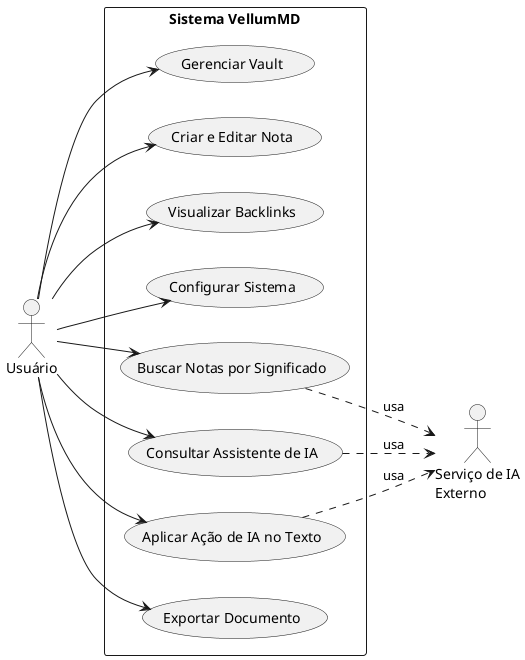
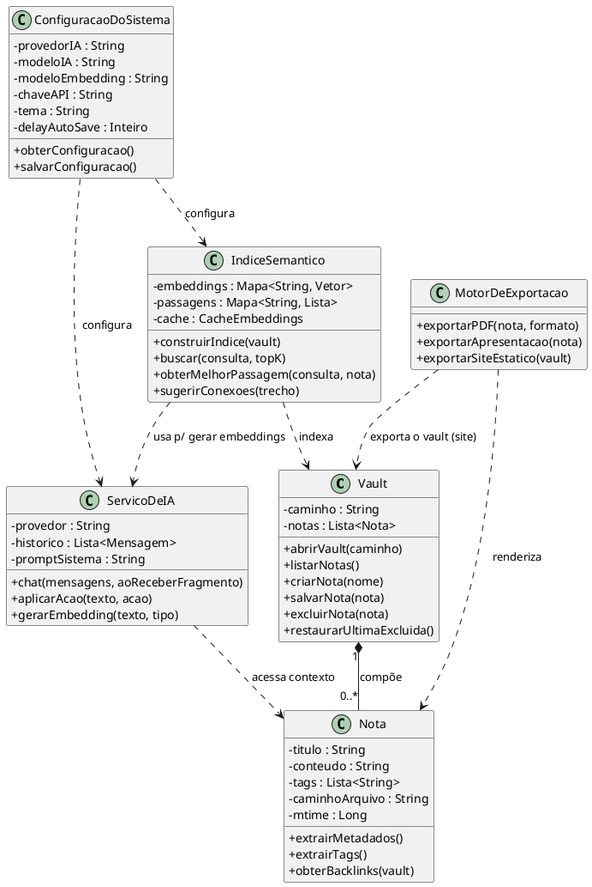
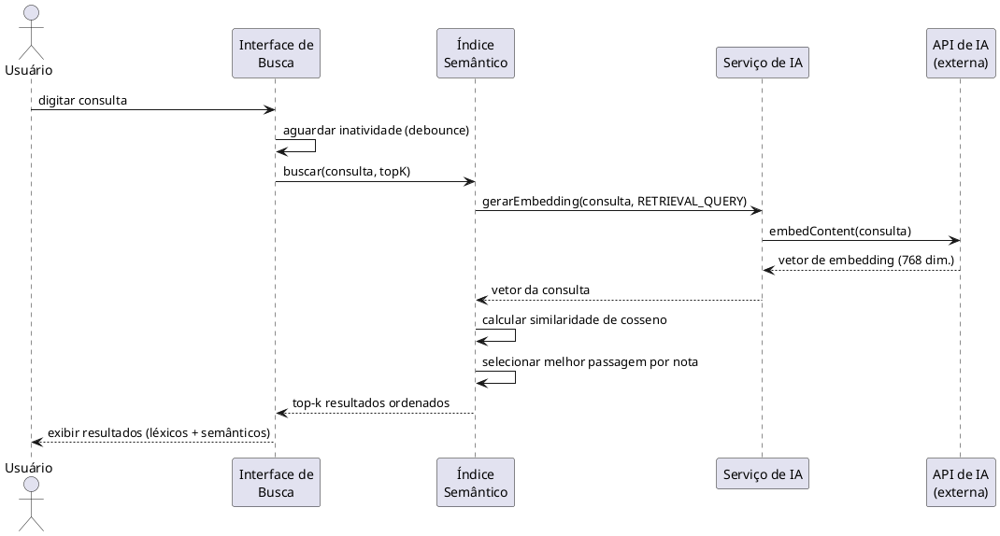
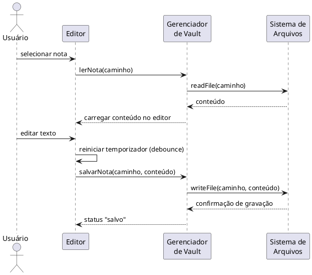

# 3 MODELAGEM E DESENVOLVIMENTO

Este capítulo apresenta a modelagem do sistema VellumMD e as decisões que orientaram
seu desenvolvimento. Inicialmente são especificados os requisitos funcionais e não
funcionais, que delimitam, respectivamente, os serviços que o software deve prestar e as
restrições de qualidade sob as quais esses serviços devem operar. Em seguida, a
estrutura e o comportamento do sistema são descritos por meio de diagramas da Linguagem
de Modelagem Unificada (UML): o diagrama de casos de uso e seus respectivos casos de uso
expandidos, o diagrama de classes e os diagramas de sequência. Por fim, é apresentado o
conjunto de ferramentas e tecnologias empregadas, relacionando cada uma à sua função
geral e à sua função específica no projeto.

A modelagem seguiu a orientação de que a UML deve ser empregada como apoio à comunicação
e ao entendimento do sistema, e não como um fim em si mesma, adotando-se apenas os
diagramas que agregam valor à compreensão do software (FOWLER, 2005, p. 25). Cabe
registrar que os diagramas de classes deste capítulo representam um modelo conceitual de
domínio, e não uma transcrição literal do código-fonte: na implementação, as entidades
modeladas materializam-se como módulos de serviço, repositórios de estado e componentes
de interface, conforme detalhado ao longo do capítulo.

## 3.1 REQUISITOS DO SISTEMA

A engenharia de requisitos abrange o conjunto de atividades que leva ao entendimento e à
especificação daquilo que o software deve fazer, servindo de ponte entre a necessidade do
usuário e o projeto da solução (PRESSMAN; MAXIM, 2021). A partir desse entendimento, os
requisitos foram organizados em duas categorias. Os requisitos funcionais descrevem as
funções e os serviços que o sistema deve oferecer; os requisitos não funcionais expressam
restrições e atributos de qualidade — tais como desempenho, segurança e portabilidade —
que qualificam a forma como esses serviços são entregues (PRESSMAN; MAXIM, 2021).

### 3.1.1 Requisitos Funcionais

O Quadro 1 relaciona os requisitos funcionais (RF) identificados para o VellumMD. Cada
requisito recebeu um identificador único, uma descrição do serviço esperado e uma
prioridade (Essencial, Importante ou Desejável), classificação que apoia o planejamento
incremental do desenvolvimento.

**Quadro 1 – Requisitos funcionais do VellumMD**

| ID | Requisito | Descrição | Prioridade |
|------|-----------|-----------|------------|
| RF01 | Abrir vault | Permitir a seleção de uma pasta local do sistema de arquivos como *vault* de trabalho. | Essencial |
| RF02 | Listar notas | Listar recursivamente, em uma árvore de navegação, os arquivos Markdown (`.md`) contidos no *vault*. | Essencial |
| RF03 | Criar nota | Criar uma nova nota Markdown no *vault*, opcionalmente com conteúdo inicial gerado por IA. | Essencial |
| RF04 | Renomear nota | Renomear uma nota existente. | Importante |
| RF05 | Excluir e restaurar nota | Excluir uma nota movendo-a para uma lixeira interna e permitir a restauração da última nota excluída. | Importante |
| RF06 | Editar nota | Editar o conteúdo da nota em um editor de texto com realce de sintaxe Markdown, histórico de desfazer/refazer e quebra automática de linha. | Essencial |
| RF07 | Salvamento automático | Persistir automaticamente as alterações da nota após um intervalo configurável de inatividade. | Essencial |
| RF08 | Pré-visualização | Renderizar a nota ativa em HTML formatado, em painel sincronizado com o editor. | Essencial |
| RF09 | Fórmulas matemáticas | Renderizar fórmulas em notação LaTeX, tanto na pré-visualização quanto de forma embutida no editor. | Importante |
| RF10 | Diagramas | Renderizar diagramas descritos em sintaxe Mermaid. | Importante |
| RF11 | Wikilinks | Reconhecer referências no formato `[[Nota]]`, com autocompletar e navegação entre notas, incluindo apelidos e âncoras de seção. | Essencial |
| RF12 | Backlinks | Exibir, para a nota ativa, a lista de notas que a referenciam. | Importante |
| RF13 | Callouts e tarefas | Suportar blocos de destaque (*callouts*) e listas de tarefas interativas sincronizadas com o arquivo. | Desejável |
| RF14 | Comandos rápidos | Oferecer comandos de barra (*slash*) no editor e uma paleta de comandos global. | Desejável |
| RF15 | Organização por tags | Extrair *tags* do *frontmatter* das notas e permitir a filtragem por *tag*. | Importante |
| RF16 | Busca léxica | Localizar notas por correspondência de termos no título e no conteúdo. | Essencial |
| RF17 | Busca semântica | Localizar notas por similaridade de significado, comparando o vetor de *embedding* da consulta com o índice do *vault*. | Essencial |
| RF18 | Indexação incremental | Construir e manter o índice semântico de forma incremental, reaproveitando resultados em *cache* para arquivos não modificados. | Essencial |
| RF19 | Sugestão de conexões | Sugerir automaticamente, durante a escrita, *wikilinks* para notas semanticamente relacionadas. | Desejável |
| RF20 | Assistente de IA | Disponibilizar um assistente em *chat* cujo contexto inclui a nota ativa, com resposta exibida progressivamente (*streaming*). | Essencial |
| RF21 | Ações rápidas de IA | Oferecer ações predefinidas de IA (resumir, expandir, corrigir, gerar diagrama, tabela e *flashcards*). | Importante |
| RF22 | Ação de IA no texto | Aplicar transformações de IA (explicar, reescrever, traduzir) sobre um trecho selecionado no editor. | Importante |
| RF23 | Configurar IA | Permitir a configuração de provedores, modelos e chaves de API para geração de texto e para *embeddings*. | Essencial |
| RF24 | Monitorar o vault | Detectar em tempo real alterações feitas no *vault* por aplicações externas e atualizar a interface. | Importante |
| RF25 | Exportar para PDF | Exportar a nota para PDF preservando fórmulas, diagramas e realce de código. | Importante |
| RF26 | Exportar apresentação | Converter a nota em uma apresentação de slides navegável. | Desejável |
| RF27 | Exportar site | Converter todo o *vault* em um site HTML estático navegável. | Desejável |
| RF28 | Preferências de interface | Alternar entre tema claro e escuro e ajustar tipografia e comportamento do editor. | Importante |

Fonte: elaborado pelo autor (2026).

### 3.1.2 Requisitos Não Funcionais

Os requisitos não funcionais frequentemente decorrem de atributos de qualidade
desejados para o produto — como desempenho, confiabilidade, segurança e portabilidade —
e, por serem restrições que se aplicam ao sistema como um todo, tendem a ser mais
críticos do que os requisitos funcionais individuais, uma vez que sua violação pode
inviabilizar o uso do software (PRESSMAN; MAXIM, 2021). O Quadro 2 apresenta os
requisitos não funcionais (RNF) do VellumMD, associando cada um à respectiva categoria de
qualidade.

**Quadro 2 – Requisitos não funcionais do VellumMD**

| ID | Categoria | Requisito |
|-------|-----------|-----------|
| RNF01 | Privacidade | As notas devem residir exclusivamente no sistema de arquivos local do usuário; nenhum conteúdo pode ser transmitido a servidores próprios do sistema, em conformidade com a Lei Geral de Proteção de Dados. |
| RNF02 | Portabilidade de dados | As notas devem ser armazenadas como arquivos Markdown puros, legíveis e editáveis por qualquer outro editor, sem formato proprietário ou banco de dados intermediário. |
| RNF03 | Portabilidade de plataforma | O sistema deve executar em Windows, macOS e Linux a partir de uma única base de código. |
| RNF04 | Desempenho (edição) | A digitação não deve apresentar latência perceptível, mesmo em notas extensas; o processamento de renderização deve limitar-se ao conteúdo visível. |
| RNF05 | Desempenho (indexação) | A indexação semântica deve minimizar as requisições à API, agrupando-as em lote, e respeitar os limites de taxa do provedor. |
| RNF06 | Resiliência | Falhas transitórias das APIs externas devem ser tratadas com novas tentativas; falhas sistêmicas devem interromper a operação com mensagem clara ao usuário. |
| RNF07 | Operação offline | As funções de edição, renderização, organização e busca léxica devem operar sem conexão com a internet; apenas os recursos de IA dependem de rede. |
| RNF08 | Segurança | O processo de interface não deve ter acesso direto ao sistema operacional; toda operação privilegiada deve passar por uma ponte de comunicação controlada, e a abertura de links externos deve ser restrita a protocolos seguros. |
| RNF09 | Usabilidade | A interface deve ser minimalista e centrada no texto, reduzindo a carga cognitiva imposta ao usuário durante a escrita. |
| RNF10 | Manutenibilidade | O código deve ser escrito com tipagem estática e organizado em módulos coesos e de baixo acoplamento. |
| RNF11 | Extensibilidade | O sistema deve suportar múltiplos provedores de IA, configuráveis pelo usuário sem alteração de código. |
| RNF12 | Interoperabilidade | A partir de uma única fonte Markdown, o sistema deve gerar saídas em múltiplos formatos (PDF, HTML e apresentação). |

Fonte: elaborado pelo autor (2026).

## 3.2 DIAGRAMA DE CASOS DE USO

O diagrama de casos de uso descreve as interações entre o sistema e os agentes externos a
ele, capturando as funcionalidades sob a perspectiva de quem as utiliza; cada caso de uso
representa uma unidade de comportamento significativo do ponto de vista de um ator, e não
os detalhes internos de sua realização (FOWLER, 2005, p. 104). Os casos de uso são,
assim, um instrumento eficaz para expressar os requisitos funcionais em termos de
cenários de utilização (PRESSMAN; MAXIM, 2021).

Foram identificados dois atores para o VellumMD. O **Usuário** é o ator principal, que
interage diretamente com todas as funcionalidades do editor. O **Serviço de IA Externo** é
um ator secundário — um sistema externo que participa dos casos de uso dependentes de
inteligência artificial (busca semântica, assistente e ações de IA sobre o texto),
fornecendo as respostas de geração de texto e de *embeddings*. A **Figura 1** apresenta o
diagrama de casos de uso, o primeiro diagrama do capítulo.

**Figura 1 – Diagrama de casos de uso do sistema VellumMD**

Fonte: elaborado pelo autor (2026).

### 3.2.1 Casos de Uso Expandidos

O diagrama de casos de uso oferece uma visão geral das funcionalidades, porém não detalha
o comportamento de cada interação. Esse detalhamento é fornecido pela descrição textual —
o caso de uso expandido —, que registra o passo a passo da interação entre o ator e o
sistema, incluindo pré-condições, o fluxo principal de eventos e os fluxos alternativos ou
de exceção (PRESSMAN; MAXIM, 2021). Os Quadros 3 a 10 apresentam os oito casos de uso
expandidos do VellumMD.

**Quadro 3 – Caso de uso expandido UC01: Gerenciar Vault**

| Campo | Descrição |
|-------|-----------|
| **Identificador** | UC01 |
| **Nome** | Gerenciar Vault |
| **Ator principal** | Usuário |
| **Descrição** | Permite selecionar a pasta de trabalho e realizar operações de criação, renomeação e exclusão de notas. |
| **Pré-condições** | O aplicativo está em execução. |
| **Pós-condições** | O *vault* selecionado é exibido na árvore de arquivos e as operações realizadas são refletidas no sistema de arquivos. |
| **Fluxo principal** | 1. O usuário solicita a abertura de um *vault*. 2. O sistema exibe o diálogo de seleção de pasta. 3. O usuário escolhe uma pasta. 4. O sistema lê recursivamente os arquivos `.md` e exibe a árvore de navegação. 5. O usuário cria, renomeia ou exclui notas conforme necessário. 6. O sistema aplica cada operação ao sistema de arquivos e atualiza a árvore. |
| **Fluxos alternativos** | 3a. O usuário cancela a seleção: o sistema mantém o estado anterior. 5a. Ao excluir, a nota é movida para a lixeira interna, permitindo restauração (RF05). |
| **Requisitos associados** | RF01, RF02, RF03, RF04, RF05 |

Fonte: elaborado pelo autor (2026).

**Quadro 4 – Caso de uso expandido UC02: Criar e Editar Nota**

| Campo | Descrição |
|-------|-----------|
| **Identificador** | UC02 |
| **Nome** | Criar e Editar Nota |
| **Ator principal** | Usuário |
| **Descrição** | Permite redigir e formatar o conteúdo de uma nota, com salvamento automático e recursos de escrita técnica. |
| **Pré-condições** | Um *vault* está aberto. |
| **Pós-condições** | O conteúdo da nota é persistido no arquivo correspondente. |
| **Fluxo principal** | 1. O usuário seleciona ou cria uma nota. 2. O sistema carrega o conteúdo no editor. 3. O usuário edita o texto em Markdown. 4. O sistema atualiza a pré-visualização e reinicia o temporizador de salvamento. 5. Após o intervalo de inatividade, o sistema grava a nota no disco. |
| **Fluxos alternativos** | 3a. O usuário insere fórmula LaTeX, diagrama Mermaid ou *wikilink*: o sistema os reconhece e os renderiza (RF09, RF10, RF11). 5a. Se o usuário trocar de nota antes do intervalo, o sistema grava imediatamente as alterações pendentes. 5b. Em caso de falha de gravação, o sistema sinaliza o erro na barra de status. |
| **Requisitos associados** | RF06, RF07, RF08, RF09, RF10, RF11, RF13, RF14 |

Fonte: elaborado pelo autor (2026).

**Quadro 5 – Caso de uso expandido UC03: Visualizar Backlinks**

| Campo | Descrição |
|-------|-----------|
| **Identificador** | UC03 |
| **Nome** | Visualizar Backlinks |
| **Ator principal** | Usuário |
| **Descrição** | Exibe as notas que referenciam a nota atualmente ativa, revelando as conexões reversas da base de conhecimento. |
| **Pré-condições** | Uma nota está aberta. |
| **Pós-condições** | A lista de notas referenciadoras é exibida no painel de *backlinks*. |
| **Fluxo principal** | 1. O usuário abre uma nota. 2. O usuário acessa o painel de *backlinks*. 3. O sistema percorre o conteúdo das notas do *vault* em busca de *wikilinks* que apontem para a nota ativa. 4. O sistema exibe a lista de notas referenciadoras. 5. O usuário seleciona um item para navegar até a nota correspondente. |
| **Fluxos alternativos** | 4a. Nenhuma nota referencia a nota ativa: o sistema informa a ausência de *backlinks*. |
| **Requisitos associados** | RF11, RF12 |

Fonte: elaborado pelo autor (2026).

**Quadro 6 – Caso de uso expandido UC04: Configurar Sistema**

| Campo | Descrição |
|-------|-----------|
| **Identificador** | UC04 |
| **Nome** | Configurar Sistema |
| **Ator principal** | Usuário |
| **Descrição** | Permite ajustar provedores, modelos e chaves de IA, além de preferências de aparência e de comportamento do editor. |
| **Pré-condições** | O aplicativo está em execução. |
| **Pós-condições** | As configurações são persistidas e aplicadas às demais funcionalidades. |
| **Fluxo principal** | 1. O usuário abre as configurações. 2. O usuário seleciona o provedor de IA, o modelo e informa a chave de API. 3. O usuário ajusta o modelo de *embedding*, o tema e o intervalo de salvamento. 4. O sistema valida e persiste as configurações. |
| **Fluxos alternativos** | 2a. O usuário solicita a descoberta automática dos modelos disponíveis na conta: o sistema consulta a API e lista os modelos. 4a. Chave inválida: o sistema sinaliza o erro ao testar a conexão. |
| **Requisitos associados** | RF23, RF28 |

Fonte: elaborado pelo autor (2026).

**Quadro 7 – Caso de uso expandido UC05: Buscar Notas por Significado**

| Campo | Descrição |
|-------|-----------|
| **Identificador** | UC05 |
| **Nome** | Buscar Notas por Significado |
| **Atores** | Usuário (principal); Serviço de IA Externo (secundário) |
| **Descrição** | Recupera notas por proximidade semântica com a consulta, e não apenas por correspondência exata de termos. |
| **Pré-condições** | O índice semântico está construído e há uma chave de API válida configurada. |
| **Pós-condições** | Os resultados mais relevantes são exibidos, ordenados por similaridade. |
| **Fluxo principal** | 1. O usuário digita uma consulta na busca. 2. O sistema aguarda uma breve inatividade (*debounce*). 3. O sistema solicita ao Serviço de IA o *embedding* da consulta. 4. O sistema calcula a similaridade de cosseno entre a consulta e o índice do *vault*. 5. O sistema seleciona a passagem mais relevante de cada nota. 6. O sistema exibe os resultados combinados (léxicos e semânticos), ordenados por relevância. |
| **Fluxos alternativos** | 3a. Falha na comunicação com a API: o sistema mantém apenas os resultados léxicos. 1a. O índice não está pronto: o sistema informa que a busca semântica está indisponível. |
| **Requisitos associados** | RF16, RF17, RF18 |

Fonte: elaborado pelo autor (2026).

**Quadro 8 – Caso de uso expandido UC06: Consultar Assistente de IA**

| Campo | Descrição |
|-------|-----------|
| **Identificador** | UC06 |
| **Nome** | Consultar Assistente de IA |
| **Atores** | Usuário (principal); Serviço de IA Externo (secundário) |
| **Descrição** | Permite conversar com um assistente que conhece o conteúdo da nota ativa e responde de forma contextual. |
| **Pré-condições** | Há uma chave de API válida configurada. |
| **Pós-condições** | A resposta do assistente é exibida e pode ser inserida na nota. |
| **Fluxo principal** | 1. O usuário envia uma mensagem ou aciona uma ação rápida. 2. O sistema monta o contexto incluindo o conteúdo da nota ativa. 3. O sistema envia a solicitação ao Serviço de IA. 4. O sistema exibe a resposta progressivamente, à medida que é recebida. 5. O usuário opta por inserir a resposta no editor. |
| **Fluxos alternativos** | 3a. Chave ausente ou inválida: o sistema exibe orientação para configurá-la. 4a. Falha durante a geração: o sistema exibe a mensagem de erro correspondente. |
| **Requisitos associados** | RF20, RF21 |

Fonte: elaborado pelo autor (2026).

**Quadro 9 – Caso de uso expandido UC07: Aplicar Ação de IA no Texto**

| Campo | Descrição |
|-------|-----------|
| **Identificador** | UC07 |
| **Nome** | Aplicar Ação de IA no Texto |
| **Atores** | Usuário (principal); Serviço de IA Externo (secundário) |
| **Descrição** | Aplica transformações de IA — explicar, reescrever ou traduzir — sobre um trecho selecionado diretamente no editor. |
| **Pré-condições** | Há um trecho de texto selecionado e uma chave de API válida. |
| **Pós-condições** | O resultado é exibido para o usuário, que pode substituir o trecho ou descartá-lo. |
| **Fluxo principal** | 1. O usuário seleciona um trecho e aciona o menu de ações de IA. 2. O usuário escolhe a ação desejada. 3. O sistema envia o trecho e a instrução ao Serviço de IA. 4. O sistema exibe o resultado em um painel de pré-visualização. 5. O usuário aplica o resultado, substituindo o trecho original. |
| **Fluxos alternativos** | 5a. O usuário cancela: o texto original é mantido. 3a. Falha na geração: o sistema informa o erro sem alterar o texto. |
| **Requisitos associados** | RF22 |

Fonte: elaborado pelo autor (2026).

**Quadro 10 – Caso de uso expandido UC08: Exportar Documento**

| Campo | Descrição |
|-------|-----------|
| **Identificador** | UC08 |
| **Nome** | Exportar Documento |
| **Ator principal** | Usuário |
| **Descrição** | Converte a nota ou o *vault* em formatos de distribuição: PDF, apresentação de slides ou site estático. |
| **Pré-condições** | Uma nota está aberta (para PDF e slides) ou um *vault* está aberto (para site). |
| **Pós-condições** | O arquivo ou a pasta de saída é gravado no destino escolhido. |
| **Fluxo principal** | 1. O usuário abre o diálogo de exportação e escolhe o formato. 2. O sistema converte o conteúdo Markdown, preservando fórmulas, diagramas e realce de código. 3. O sistema solicita o destino da gravação. 4. O sistema gera o artefato e confirma a conclusão. |
| **Fluxos alternativos** | 2a. Exportação de site: o sistema processa todas as notas do *vault* e converte os *wikilinks* em hiperligações. 4a. Falha na gravação: o sistema exibe a mensagem de erro. |
| **Requisitos associados** | RF25, RF26, RF27 |

Fonte: elaborado pelo autor (2026).

## 3.3 DIAGRAMA DE CLASSES

O diagrama de classes descreve a estrutura estática do sistema, apresentando os tipos de
objetos do domínio, seus atributos e operações, bem como os relacionamentos entre eles; é
o diagrama mais utilizado da UML e o que melhor expressa o vocabulário conceitual de um
sistema orientado a objetos (FOWLER, 2005, p. 52). No contexto da modelagem de
requisitos, a identificação das classes decorre da análise dos substantivos relevantes do
domínio e das responsabilidades que o sistema deve assumir (PRESSMAN; MAXIM, 2021).

A **Figura 2**, segundo diagrama do capítulo, apresenta o modelo conceitual do VellumMD em
seis classes. Adotou-se a convenção de encapsulamento, na qual os atributos são privados
(sinal `-`) e o acesso ao estado interno ocorre por meio de operações públicas (sinal
`+`). A classe **Vault** compõe-se de zero ou mais objetos **Nota** (relação de
composição, com multiplicidade `1` para `0..*`), refletindo que as notas só existem no
contexto de um *vault* aberto. O **IndiceSemantico** depende do **Vault** para indexá-lo e
do **ServicoDeIA** para gerar as representações vetoriais. O **ServicoDeIA** — que na
implementação concentra tanto a geração de texto do assistente quanto a geração de
*embeddings*, por utilizarem a mesma interface de provedores de IA — acessa o contexto da
**Nota** ativa. O **MotorDeExportacao** renderiza as notas nos formatos de saída, e a
**ConfiguracaoDoSistema** parametriza tanto o serviço de IA quanto o índice semântico.

**Figura 2 – Diagrama de classes (modelo conceitual de domínio) do sistema VellumMD**

Fonte: elaborado pelo autor (2026).

## 3.4 DIAGRAMA DE SEQUÊNCIA

Enquanto o diagrama de classes descreve a estrutura estática, o diagrama de sequência
descreve o comportamento dinâmico: modela a colaboração entre objetos ao longo do tempo
para a realização de um cenário, evidenciando a ordem cronológica das mensagens trocadas
entre os participantes (FOWLER, 2005, p. 67). Optou-se por detalhar o fluxo de **busca
semântica** como diagrama de sequência principal, por constituir o diferencial central do
sistema e por exercitar a colaboração entre a interface, o índice, o serviço de IA e o
ator externo. Um segundo diagrama, complementar, detalha o fluxo de edição com salvamento
automático — o ciclo mais frequente de uso do editor.

A **Figura 3**, terceiro diagrama do capítulo, apresenta o fluxo de busca semântica. Ao
digitar a consulta, a interface aguarda uma breve inatividade antes de acionar o índice,
evitando requisições a cada tecla. O índice solicita ao serviço de IA a vetorização da
consulta (com o tipo de tarefa apropriado para recuperação) e, de posse do vetor, calcula
localmente a similaridade de cosseno contra o índice em memória — ou seja, apenas a
vetorização da consulta depende da rede; a comparação é inteiramente local.

**Figura 3 – Diagrama de sequência: fluxo de busca semântica (principal)**

Fonte: elaborado pelo autor (2026).

A **Figura 4**, quarto diagrama do capítulo, apresenta o fluxo complementar de edição e
salvamento automático. Ao selecionar uma nota, o editor solicita a leitura do conteúdo ao
gerenciador de *vault*; a cada alteração, um temporizador é reiniciado, e a gravação em
disco ocorre somente após o intervalo de inatividade, evitando escritas redundantes a cada
tecla digitada.

**Figura 4 – Diagrama de sequência: edição com salvamento automático (complementar)**

Fonte: elaborado pelo autor (2026).

## 3.5 FERRAMENTAS E TECNOLOGIAS UTILIZADAS

O desenvolvimento do VellumMD apoiou-se em um conjunto de ferramentas e bibliotecas de
código aberto, selecionadas para atender aos requisitos de portabilidade, desempenho e
operação local. O Quadro 11 relaciona cada tecnologia à sua função geral — o papel que
desempenha no ecossistema de desenvolvimento — e à sua função específica no projeto.

**Quadro 11 – Ferramentas e tecnologias utilizadas no desenvolvimento do VellumMD**

| Ferramenta / Tecnologia | Função geral | Função específica no VellumMD |
|-------------------------|--------------|-------------------------------|
| Electron | *Framework* para aplicações *desktop* multiplataforma com tecnologias web | Empacota o sistema para Windows, macOS e Linux; provê o processo principal com acesso ao sistema de arquivos e à geração nativa de PDF |
| Node.js | Ambiente de execução de JavaScript fora do navegador | Executa o processo principal do Electron: operações de arquivo, comunicação entre processos e exportação |
| TypeScript | Superconjunto tipado de JavaScript | Linguagem de toda a base de código, garantindo verificação estática de tipos |
| React | Biblioteca para construção de interfaces reativas | Estrutura a interface do processo de renderização (editor, pré-visualização, painéis e modais) |
| Vite | Empacotador e servidor de desenvolvimento | Realiza a construção de produção e o desenvolvimento com recarga instantânea |
| Zustand | Biblioteca de gerenciamento de estado | Mantém o estado global do *vault* e das configurações do usuário |
| CodeMirror 6 | Componente de editor de código extensível | Constitui o núcleo de edição Markdown, com realce de sintaxe, histórico e extensões próprias |
| unified / remark / rehype | Ecossistema de processamento de Markdown por árvore sintática | Converte o Markdown em HTML na pré-visualização e nas exportações, com extensões para *wikilinks* e *callouts* |
| KaTeX | Biblioteca de renderização de notação matemática | Renderiza fórmulas LaTeX localmente, no editor e na pré-visualização |
| Mermaid | Biblioteca de geração de diagramas a partir de texto | Renderiza diagramas descritos em sintaxe própria como imagens vetoriais |
| Reveal.js | *Framework* de apresentações em HTML | Estrutura as apresentações de slides geradas pela exportação |
| API do Google (Gemini/Gemma) | Serviço de modelos de linguagem e de *embeddings* | Gera os *embeddings* da busca semântica e as respostas do assistente |
| APIs OpenAI, Anthropic e Groq | Serviços de modelos de linguagem | Provedores alternativos de IA, configuráveis pelo usuário |
| electron-builder | Ferramenta de empacotamento e distribuição de aplicações Electron | Gera os instaladores do sistema para as plataformas-alvo |
| Git | Sistema de controle de versão distribuído | Versiona o código-fonte e registra o histórico incremental do desenvolvimento |
| PlantUML | Ferramenta de geração de diagramas UML a partir de texto | Produz os diagramas de modelagem apresentados neste capítulo |

Fonte: elaborado pelo autor (2026).

## 3.6 CONSIDERAÇÕES DO CAPÍTULO

Este capítulo especificou os requisitos funcionais e não funcionais do VellumMD e modelou
sua estrutura e comportamento por meio de quatro diagramas UML — casos de uso, classes e
dois diagramas de sequência —, complementados pelos casos de uso expandidos e pelo quadro
de ferramentas. A modelagem manteve correspondência com a implementação real do sistema,
tratando o diagrama de classes como um modelo conceitual de domínio, e não como
transcrição literal do código. O conjunto de artefatos aqui apresentado fundamenta o
desenvolvimento descrito nas seções seguintes e evidencia como as decisões de projeto
atendem aos requisitos de privacidade, desempenho e operação local que orientam o
trabalho.
