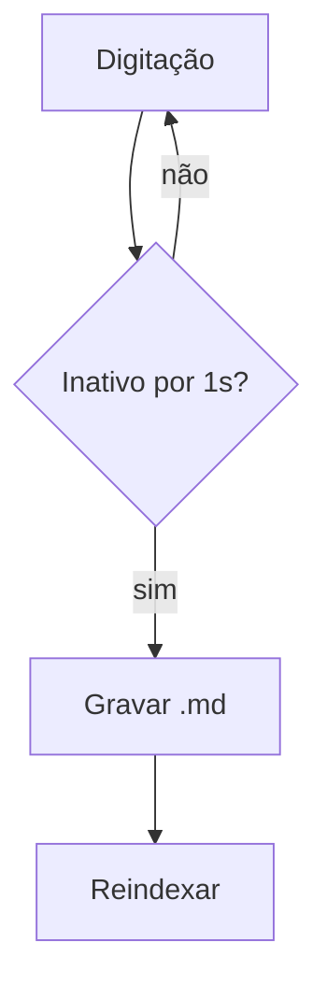
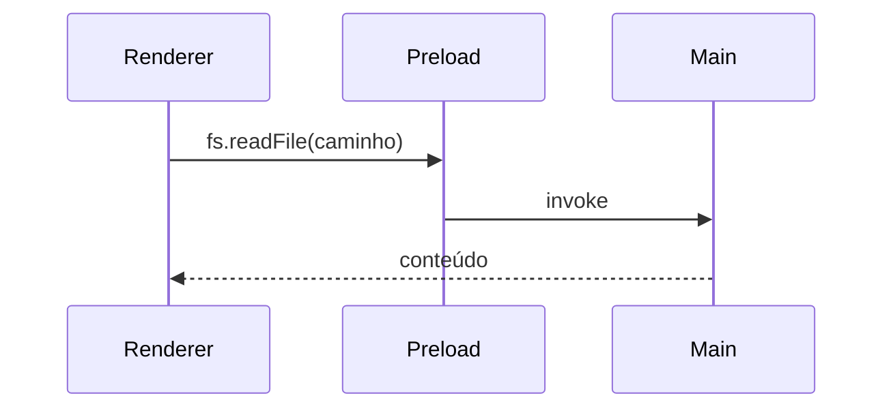

# Diagramas

Fluxo do salvamento automático:

```mermaid
graph TD
  A["Digitação"] --> B{"Inativo por 1s?"}
  B -- "não" --> A
  B -- "sim" --> C["Gravar .md"]
  C --> D["Reindexar"]
```

Troca de mensagens entre os processos:

```mermaid
sequenceDiagram
  participant R as Renderer
  participant P as Preload
  participant M as Main
  R->>P: fs.readFile(caminho)
  P->>M: invoke
  M-->>R: conteúdo
```

Sintaxe Mermaid 11. Ver [[Arquitetura]].
